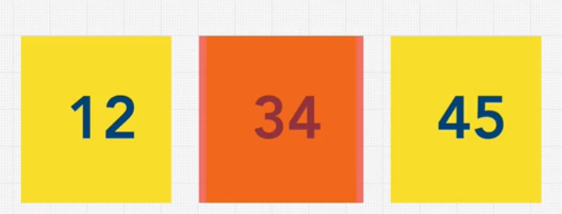
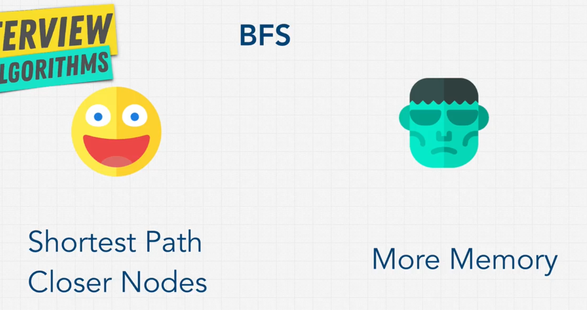

# Data Structures and Algorithms

## Big O Notation


### Rules for Calculating Big O

- **Worst Case**
- **Remove Constants**
- **Different Terms for Inputs**
- **Drop Non-Dominant Terms**

---

### **O(n) - Linear Time**
- The number of inputs grows, and the number of operations also grows.
- For example, using `foreach` loops and `for` loops.

### **O(1) - Constant Time**
- Regardless of the number of inputs, the number of operations is always one.
- Example: `console.log(array[1])`

### **O(n^2) - Quadratic Time**

- Whenever we have nested loops, it becomes `O(n * n)`, which is `O(n^2)`.

### **O(n!) - Factorial**
- adding nested loops for every element .
---

### **Rule 1 - Worst Case**
- Always consider the worst-case scenario of a function.
- In the example below, "nemo" could be found in `array[0]` or `array[n]`.
- The worst case is `array[n]`, so the Big O is **O(n)**.


### **Rule 2 - Remove Constants**

- In this example, we remove the constants: `O(1 + n/2 + 100)` becomes `O(n)`.

### **Rule 3 - Different Terms for Inputs**

- The Big O here is `O(2n)`. After dropping the constants, it becomes `O(n)`.
- However, if the inputs are different:
  
  - Then the Big O is `O(a + b)`.

### **Rule 4 - Drop Non-Dominants**
- Always keep the dominant terms and remove non-dominant ones.

- In this case, if `x` is 5, the largest term is 100. However, we always consider scalability. If `x` is 500, `x^2` becomes dominant. Thus, the answer is `O(x^2)`.
- If the nested loops grow, the power value increases (e.g., 2, 3, 4, etc.). However, this is not ideal for performance.

### **Notes**
- Iterating to half a collection is ```O(n)```. 
- Iteration to two different inputs is ```O(n + m)```.  

### **How to chose a best code?** 


- So the Big ```O``` reley on space and time complexity. we can also calculate big ```O``` for space.

### **What can cause time in a function?**
- Operations (+, -, *, /)
- Comparisons (<, >, ==)
- Looping (for, while)
- Outside Function call (function())

### **What can cause space in a function?**
- Variables
- Data structures
- Function calls
- Allocations

### **How to calculate big O for space***


- Here we dont do any allocations or function calls so it ```O(n)```
 
- Here we do variables and allocations so its ```O(1 + n)``` goes ```O(n)```

