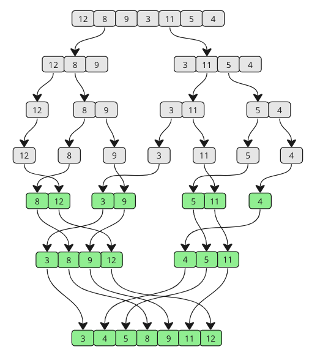
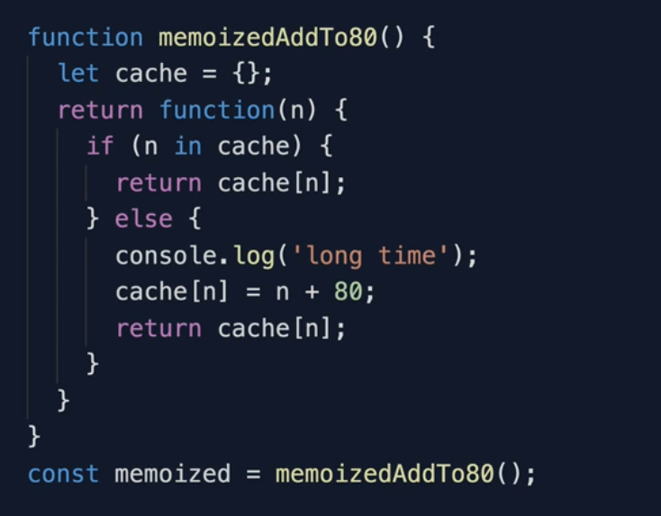

# Table of contents
1. [Big O Notation](#bigo)
2. [Steps to solve a problem](#steps)
3. [Data Structures](#ds)
   1. [Arrays](#arrays)
   2. [Hashtables](#hashtables)
   3. [Linked Lists](#ll)
   4. [Stacks and Queues](#stacks)
   
## Big O Notation <a name="bigo"></a>



### Rules for Calculating Big O

- **Worst Case**
- **Remove Constants**
- **Different Terms for Inputs**
- **Drop Non-Dominant Terms**

---

### **O(n) - Linear Time**
- The number of inputs grows, and the number of operations also grows.
- For example, using `foreach` loops and `for` loops.

### **O(1) - Constant Time**
- Regardless of the number of inputs, the number of operations is always one.
- Example: `console.log(array[1])`

### **O(n^2) - Quadratic Time**

- Whenever we have nested loops, it becomes `O(n * n)`, which is `O(n^2)`.

### **O(n!) - Factorial**
- adding nested loops for every element .
---

### **Rule 1 - Worst Case** 
- Always consider the worst-case scenario of a function.
- In the example below, "nemo" could be found in `array[0]` or `array[n]`.
- The worst case is `array[n]`, so the Big O is **O(n)**.


### **Rule 2 - Remove Constants**
  
- In this example, we remove the constants: `O(1 + n/2 + 100)` becomes `O(n)`.

### **Rule 3 - Different Terms for Inputs**

- The Big O here is `O(2n)`. After dropping the constants, it becomes `O(n)`.
- However, if the inputs are different:
  
  - Then the Big O is `O(a + b)`.

### **Rule 4 - Drop Non-Dominants**
- Always keep the dominant terms and remove non-dominant ones.

- In this case, if `x` is 5, the largest term is 100. However, we always consider scalability. If `x` is 500, `x^2` becomes dominant. Thus, the answer is `O(x^2)`.
- If the nested loops grow, the power value increases (e.g., 2, 3, 4, etc.). However, this is not ideal for performance.

### **Notes**
- Iterating to half a collection is ```O(n)```. 
- Iteration to two different inputs is ```O(n + m)```.  

### **How to choose a best code?** 


- So the Big ```O``` reley on space and time complexity. we can also calculate big ```O``` for space.

### **What can cause time in a function?**
- Operations (+, -, *, /)
- Comparisons (<, >, ==)
- Looping (for, while)
- Outside Function call (function())

### **What can cause space in a function?**
- Variables
- Data structures
- Function calls
- Allocations

### **How to calculate big O for space**


- Here we dont do any allocations or function calls so it ```O(n)```
 
- Here we do variables and allocations so its ```O(1 + n)``` goes ```O(n)```

### Steps to solve a problem <a name="steps"></a>
1. Write down the key points of a problem.
2. Write down the sample input and output.
3. Start with a easy approach.
4. Then think of its problem in that approach and tell them why its no the best like its ```O(n^2)``` etc..
5. Then start your best approach.
6. Think about all the error checks and add a fix for that error.
7. Then test your code with all type of ```input, no input, null, undefined```

---
## Data Structures <a name="ds"></a>

### Arrays <a name=arrays></a>

**Static Arrays**
- These are the arrays with fixed size.

**Dynamic Arrays**
- These are the arrays without fixed size.

#### Time constraints of array methods


#### Notes
- If you get any string related questions then split into array.Then 

  

### Hashtables <a name=hashtables></a>
- Hashtables are key value pairs. Key values are convereted into hashes. For example : ```Objects``` in js
- In hashtable we can have keys of any type. Ex: ```Map``` in js. In Map datas are inserted in sequential order. Not random memory like object.
- We have also ```Sets``` in js. It can only store the keys. 

#### HashFunction
- Takes the key and convert it to hashes and assings a memory address.

  

  

#### Hashtable Collision
- In hashtables there is posibility of two different hashes may share the same memory space.
  

#### Hashtable Vs Arrays
- Search is ```O(n)``` in arrays where as its ```O(1)``` in Hashtables. Likewise many methods.

- The major difference is hashtables datas are store in different index, irrespective of the order. whereas in arrays the datas are store in sequential order starting index ```0```

#### Pros and Cons
- We use hashtables mostly for time optimizaition but it may take more space. There is always a tradeoff between these time and space. If time is more important then use hashtables.
- There can be possible collision but our progamming language handles it internally. We dont need to worry.

  

### Linked Lists <a name=ll></a>

- Lists which are linked. The first node is head and last node is tail

  

- Each links have the pointers and the last tail does not have a pointer.
 
  

- Check this link to see how Linkedlist works [here](https://visualgo.net/en/list)

  

#### Pointers
- Pointers hold the reference to a memory location.
  
  - in the above example ```{a: true}``` is a value in the memory. So both ```obj1``` and ```obj2``` holds the reference to that memrory location. 

#### Doubly linked list
- This holds the pointer to next link and also prev link.
- So compare to singly searching will be more effecient.
- In singly we can only traverse from start to end. But here we can also do end to start.

  

#### Pros and Cons


#### Difference singly vs doubly


### Stacks and queues <a name=stacks></a>

#### Stacks
- Last in first out.
  

#### Queues
- First in first out.
  

#### Why we are not using arrays to build queues?
- The reason is when we pop or push something. all the items in the array are reindexing. i.e changing their indexes.
