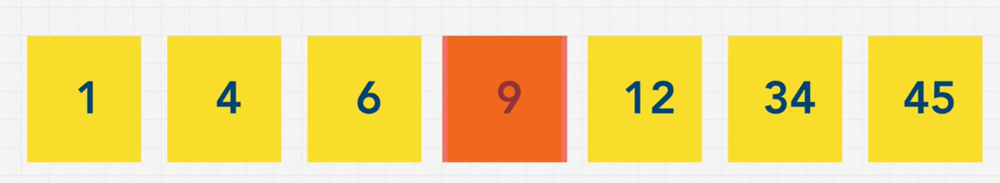
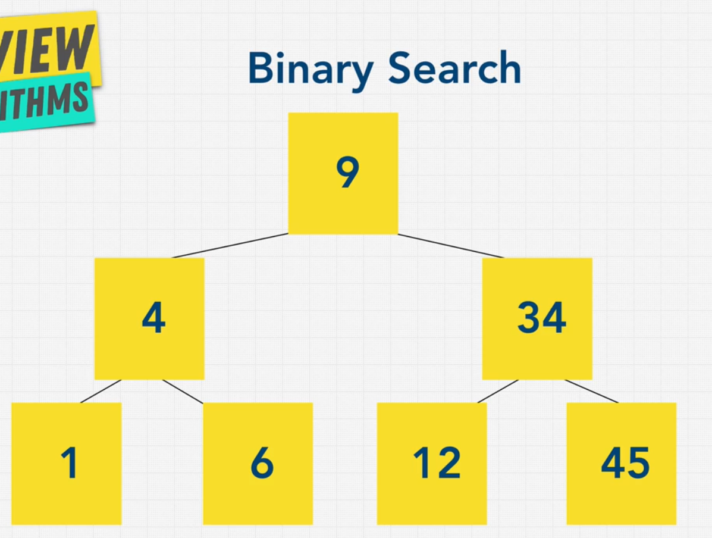
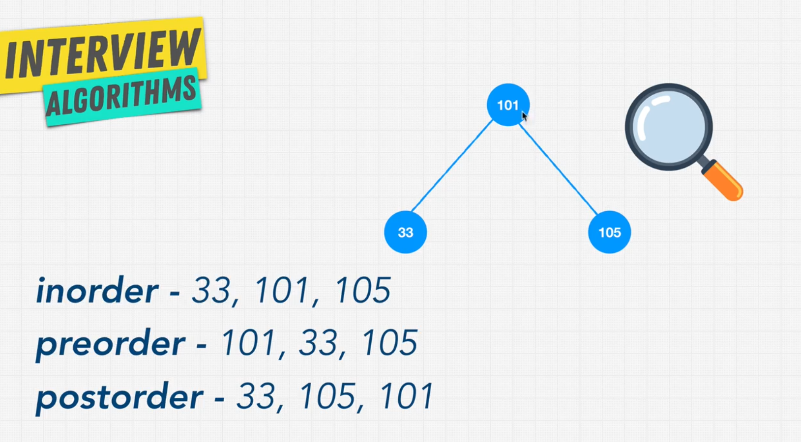

# 📌 Table of Contents


1. [⚡ Big O Notation](#bigo)
2. [🛠️ Steps to Solve a Problem](#steps)
3. [📂 Data Structures](#ds)
   - 📌 [Arrays](#arrays)
   - 🔑 [Hashtables](#hashtables)
   - 🔗 [Linked Lists](#ll)
   - 📦 [Stacks and Queues](#stacks)
   - 🌳 [Trees](#trees)
   - 🔍 [Graphs](#graphs)
4. [⚙️ Algorithms](#algorithms)
   - 🔁 [Recursions](#recursions)
   - 🌀 [Sorting](#sorting)
     - 🔵 [Bubble Sort](#bubble)
     - 🔷 [Selection Sort](#selection)
     - 🟠 [Insertion Sort](#insertion)
     - ⚡ [Merge Sort](#merge)
     - ⚔️ [Quick Sort](#quick)
     - 📊 [Radix Sort](#radix)
   - 🔎 [Searching](#searching)
     - 🔍 [Linear Search](#linear)
     - 📈 [Binary Search](#binary)
     - 🌐 [BFS (Breadth First Search)](#bfs)
     - 🌳 [DFS (Depth First Search)](#dfs)
     - 📊 [Types of DFS Traversals](#ttt)
     - 🚀 [Graph Algorithms: Dijkstra, Bellman-Ford, DFS, BFS](#Dijkstra)

---

## ⚡ Big O Notation <a name="bigo"></a>


### 🔢 **Rules for Calculating Big O**
- ✅ **Worst Case**
- ✅ **Remove Constants**
- ✅ **Different Terms for Inputs**
- ✅ **Drop Non-Dominant Terms**

---

### 📈 **O(n) - Linear Time**
✔️ As the input size increases, the number of operations **grows proportionally**.  
✔️ Example: Using `foreach` loops and `for` loops.

---

### ⚡ **O(1) - Constant Time**
✔️ No matter the input size, the number of operations **remains the same**.  
✔️ Example: `console.log(array[1])`

---

### 🔄 **O(n²) - Quadratic Time**

✔️ **Nested loops** result in `O(n * n)`, which simplifies to **O(n²)**.

---

### 🚀 **O(n!) - Factorial Time**
✔️ **Nested loops for every element** (very slow!).  

---

### 🔍 **O(log n) - Logarithmic Time**
✔️ As `n` increases, operations grow **slowly** instead of linearly or quadratically.  
  


---

## 📌 **Big O Rules**
### 📉 **Rule 1 - Worst Case** 
✔️ Always consider the **worst-case scenario**.  
✔️ Example: Searching for `"nemo"` in an array.  
✔️ If `"nemo"` is the last element, **O(n)** applies.  


---

### ✂️ **Rule 2 - Remove Constants**
✔️ `O(1 + n/2 + 100)` simplifies to **O(n)**.  


---

### 🔀 **Rule 3 - Different Terms for Inputs**
✔️ `O(2n)` simplifies to **O(n)**.  
✔️ But if inputs are different:  
   - `O(a + b)`, not `O(n)`.  


---

### 🎭 **Rule 4 - Drop Non-Dominants**
✔️ Keep only **dominant terms**.  
✔️ Example: If `x = 500`, `x²` is **dominant**, so **O(x²)**.  
✔️ Nested loops increase power (`O(n²) → O(n³)`).  


---

## ✨ **Big O Notes**
- 🚀 **Iterating through half a collection → `O(n)`**.  
- 📊 **Iterating through two different inputs → `O(n + m)`**.

---

## 🧐 **How to Choose the Best Code?**


✔️ **Big O depends on space & time complexity**.  
✔️ **We can also calculate Big O for space usage**.

---

## ⏳ **What Affects Time Complexity?**
✔️ Arithmetic operations `(+,-,*,/)`.  
✔️ Comparisons `(<, >, ==)`.  
✔️ Looping (`for`, `while`).  
✔️ Function calls.

---

## 🧠 **What Affects Space Complexity?**
✔️ Variables.  
✔️ Data structures.  
✔️ Function calls.  
✔️ Allocations.

---

## 🛠️ Steps to Solve a Problem <a name="steps"></a>
1. 📝 Write down the key points of the problem.  
2. 📋 Write down sample inputs and outputs.  
3. 🛠️ Start with an easy approach.  
4. 🤔 Analyze the problems in that approach (e.g., `O(n²)`).  
5. 🚀 Start your best approach.  
6. 🛑 Think about error checks and fixes.  
7. 🧪 Test your code with all types of inputs (`null`, `undefined`, etc.).

---

## 📂 Data Structures <a name="ds"></a>

### 📌 Arrays <a name="arrays"></a>
- **Static Arrays**: Fixed size.  
- **Dynamic Arrays**: No fixed size.  

#### ⏱️ Time Constraints of Array Methods


#### 📝 Notes
- 📌 If you get string-related questions, split them into arrays.  
  

---

### 🔑 Hashtables <a name="hashtables"></a>
- 📌 Key-value pairs where keys are converted into hashes.  
- 📌 **Example:** `Objects` in JS, `Map` in JS (inserted in sequential order).  
- 📌 **Sets** in JS can only store keys.  

#### 🔑 HashFunction
- 📌 Converts keys into hashes and assigns a memory address.  
    
  

#### ⚠️ Hashtable Collision
- 📌 Two different hashes may share the same memory space.  
  

#### 🔄 Hashtable Vs Arrays
- 📌 Search is `O(n)` in arrays, whereas it's `O(1)` in Hashtables.  
- 📌 Hashtables store data in different indexes, irrespective of order. Arrays store data sequentially.  
  

#### ✔️ Pros and Cons
- 📌 **Pros:** Time optimization.  
- 📌 **Cons:** May take more space.  
  

---

### 🔗 Linked Lists <a name="ll"></a>
- 📌 Lists where nodes are linked. The first node is the **head**, and the last node is the **tail**.  
    
- 📌 Each node has pointers, except the tail.  
    
- 📌 **Visualization:** [Linked List Visualization](https://visualgo.net/en/list)  
  

#### 🔗 Pointers
- 📌 Pointers hold the reference to a memory location.  
  

#### 🔄 Doubly Linked List
- 📌 Holds pointers to both the next and previous nodes.  
- 📌 **Advantage:** More efficient searching.  
  

#### ✔️ Pros and Cons


#### 🔄 Difference: Singly vs Doubly


---

### 📦 Stacks and Queues <a name="stacks"></a>

#### 📦 Stacks
- 📌 **Last in, first out (LIFO).**  
  

#### 🚶‍♂️ Queues
- 📌 **First in, first out (FIFO).**  
  

#### ⚠️ Why Not Use Arrays for Queues?
- 📌 Reindexing occurs when popping or pushing, which is inefficient.  

---

### 🌳 Trees <a name="trees"></a>


#### 🌳 Binary Tree
- 📌 Each node can have 0, 1, or 2 nodes.  
- 📌 **Perfect Binary Tree:** All levels are filled.  
- 📌 **Full Binary Tree:** Nodes have 0 or 2 children.  
  

#### 🔍 Binary Search Tree
- 📌 **Rules:**  
  - All right child nodes are greater than the parent.  
  - All left child nodes are smaller than the parent.  
  

#### ⚠️ Unbalanced Binary Search Tree
- 📌 Operations become costlier.  
    
  

#### 🌳 AVL Tree
- 📌 Automatically balances the binary tree.  

#### 🌳 Red-Black Tree
- 📌 Automatically balances the tree by switching elements.  

#### 🌳 Heaps
- 📌 **Max Heap:** Every parent node is greater than its children.  
- 📌 **Min Heap:** Every parent node is smaller than its children.  
  

#### 🌳 Trie
- 📌 Predefined data structure for solving string problems.  
    
    
  **Visualization:** [Trie Visualization](https://www.cs.usfca.edu/~galles/visualization/Trie.html)

---

### 🔍 Graphs <a name="graphs"></a>


#### 🔍 Types of Graphs
  
  


#### 🔍 Types of Weighted Graphs
- 📌 **Positive Weighted Graph:** All edges have positive weights.  
- 📌 **Negative Weighted Graph:** At least one edge has a negative weight.  
- 📌 **Negative Weight Cycle:** A cycle where the sum of edge weights is negative.  

---

## ⚙️ Algorithms <a name="algorithms"></a>

### 🔁 Recursions <a name="recursions"></a>
- 📌 Calling the function inside the same function with some condition.  
  

#### 🧐 When to Use Recursion?


---

### 🌀 Sorting <a name="sorting"></a>

#### 🔵 Bubble Sort <a name="bubble"></a>
- 📌 Compare adjacent elements and swap if they are in the wrong order.  
- 📌 Repeat until the array is sorted.  
  

#### 🔷 Selection Sort <a name="selection"></a>
- 📌 Find the smallest element and swap it with the first unsorted element.  
- 📌 Repeat until the array is sorted.  
  

#### 🟠 Insertion Sort <a name="insertion"></a>
- 📌 Build the sorted array one element at a time by inserting each element into its correct position.  
  

#### ⚡ Merge Sort <a name="merge"></a>
- 📌 Divide the array into two halves, sort each half, and merge them.  
  

#### ⚔️ Quick Sort <a name="quick"></a>
- 📌 Choose a pivot, partition the array, and recursively sort the sub-arrays.  
  

#### 📊 Radix Sort <a name="radix"></a>
- 📌 Sort numbers by their digits, starting from the least significant digit.  
  

---

### 🔎 Searching <a name="searching"></a>

#### 🔍 Linear Search <a name="linear"></a>
- 📌 Loop through the items and find the target value.  
- 📌 **Best Case:** Found immediately.  
- 📌 **Worst Case:** Found at the last index or not present.  
  

#### 📈 Binary Search <a name="binary"></a>
- 📌 **Divide & Conquer Algorithm**.  
- 📌 Check the **middle element**:  
  - If the target is **higher**, remove the **left half**.  
  - If the target is **lower**, remove the **right half**.  
- 📌 **Repeat** until the target is found.  
- ⚠️ **Only works on sorted data**.  
    
    
  

#### 🌐 BFS (Breadth First Search) <a name="bfs"></a>
- 📌 Traverse the graph **level by level**, starting from the root.  
- 📌 **Order of Traversal:** Left to right.  
- 📌 **Example:**  
  - For the tree below, BFS traversal order is:  
    ```[9, 4, 34, 1, 6, 12, 45]```  
  

#### 🌳 DFS (Depth First Search) <a name="dfs"></a>
- 📌 Traverse the graph **depth-first**, exploring as far as possible along each branch before backtracking.  
- 📌 **Order of Traversal:**  
  - Start from the root, go deep until a leaf node is reached.  
  - Backtrack and explore the next branch.  
- 📌 **Example:**  
  - For the tree below, DFS traversal order is:  
    ```[9, 4, 1, 6, 34, 12, 45]```  

#### 📊 Types of DFS Traversals <a name="ttt"></a>
- 📌 **Pre-order:**  
  - Visit the **root**, then the **left subtree**, then the **right subtree**.  
- 📌 **In-order:**  
  - Visit the **left subtree**, then the **root**, then the **right subtree**.  
- 📌 **Post-order:**  
  - Visit the **left subtree**, then the **right subtree**, then the **root**.  
    
  

---

#### 🚀 Graph Algorithms: Dijkstra, Bellman-Ford, DFS, BFS <a name="Dijkstra"></a>

##### 1. Dijkstra's Algorithm  
✅ **Use when:**  
- You need the shortest path in a graph with **non-negative weights**.  
- You want an **efficient solution** (better than Bellman-Ford) for **single-source shortest path problems**.  
- You are working with **sparse graphs** (few edges).  

❌ **Avoid if:**  
- The graph has **negative weight edges** (Dijkstra does not handle them correctly).  
- You need to find shortest paths from **multiple sources** (use **Floyd-Warshall** instead).  

📌 **Example Use Cases:**  
- **GPS navigation systems**  
- **Network routing** (when all link costs are non-negative)  

---

##### 2. Bellman-Ford Algorithm  
✅ **Use when:**  
- The graph has **negative weight edges**, and you need to find the **shortest path**.  
- You need to **detect negative weight cycles** in a graph.  

❌ **Avoid if:**  
- The graph is **large and dense** (Bellman-Ford has a **higher time complexity** than Dijkstra).  

📌 **Example Use Cases:**  
- **Financial applications** (detecting arbitrage in currency exchange graphs)  
- **Routing in networking** with **potential negative weights**  

---

##### 3. DFS & BFS (When They Are Better)  
✅ **Use DFS/BFS when:**  
- You only need to **check connectivity** or **explore a graph** (not find shortest paths).  
- The graph is **unweighted**, and you need the **shortest path** (**BFS works for unweighted graphs**).  
- You're solving problems like **topological sorting, cycle detection, or maze traversal**.  

📌 **Example Use Cases:**  
- **Web crawling**  
- **Finding connected components in a social network**  
- **Solving mazes**  

